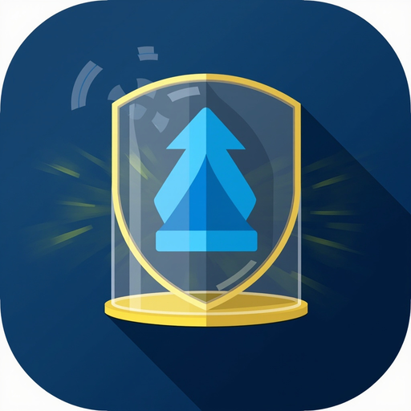

# ⬇️ qBittorrent for Dogebox

> **Latest:** v0.0.6 — **reverts the v0.0.5 bubblewrap sandbox.** The sandbox could not run inside Dogebox's systemd-nspawn pup containers: nspawn denies the fresh `/proc` mount bwrap needs (`Can't mount proc on /newroot/proc: Operation not permitted`), so qB restart-looped (verified on-box 2026-09-17). v0.0.6 returns to a direct exec but **keeps** the working v0.0.5 fixes: `WebUI\HostHeaderValidation` default-off + normalized back off on every start, the quarantine dir, and the write-if-missing conf template. See [Troubleshooting](#troubleshooting).

<p align="center"></p>

**[qBittorrent-nox](https://www.qbittorrent.org) (headless, Web UI) packaged as a [Dogebox](https://dogebox.org) pup** — the download engine for the media automation stack: [Radarr](https://github.com/PennybagsCX/dogebox-radarr-pup) / [Sonarr](https://github.com/PennybagsCX/dogebox-sonarr-pup) drive it, [Jellyfin](https://github.com/PennybagsCX/dogebox-jellyfin-pup) plays the results. Indexer definitions (including the public-domain **Internet Archive**) via [Prowlarr](https://github.com/PennybagsCX/dogebox-prowlarr-pup).

> ⚖️ qBittorrent is a general-purpose BitTorrent client. What you download and the rights to it are your responsibility — pair it with legal sources (public domain / Creative Commons) to stay clean.

## Install

Pup Store → Manage Sources → add `https://github.com/PennybagsCX/dogebox-qbittorrent-pup.git` → install **qBittorrent**. Launch the web UI from the pup screen (dogebox maps a host port).

## First run

- On first boot the WebUI allows LAN/bridge subnets without a password so you can set up — **create your credentials immediately** in the WebUI (Settings → Web UI) or via the API:

```bash
curl -X POST http://<box>:<port>/api/v2/app/setPreferences \
  -d 'json={"web_ui_username":"you","web_ui_password":"secret","web_ui_auth_subnet_whitelist_enabled":false}'
```

- Default save path: `/storage/downloads` (inside the pup).
- Radarr/Sonarr connect to it as a **qBittorrent download client** at the dogebox host port.

## Media pipeline

`qB /storage/downloads` → host sync timer (`qb-to-arrs`: episode-pattern paths rsync to Sonarr, everything else to Radarr) → Radarr/Sonarr import & rename via a `DownloadedMoviesScan` / `DownloadedEpisodesScan` API call from the same timer → existing timers move finished files into the Jellyfin library. Because pups are filesystem-isolated, the bridge is a set of host-side systemd timers (rsync + API scan calls) — see the Radarr/Sonarr pup READMEs. All of it verified running on the audit box (`radarr-to-jellyfin.timer`, `sonarr-to-jellyfin.timer`, `qb-to-arrs.timer` active).

## Troubleshooting

- **WebUI shows a bare "Unauthorized" (401) when launched from the dashboard** — qBittorrent 5.x validates Host headers by default, but the dogeboxd gateway forwards your browser's original `Host` (`<box-ip>:<mapped-port>`), so qBittorrent rejects the page. v0.0.2 ships `WebUI\HostHeaderValidation=false` in the default config and inserts it on upgrade (the config file is write-if-missing). To fix a pre-0.0.2 install at runtime, from the box:
  ```bash
  curl -X POST http://<container-ip>:8080/api/v2/app/setPreferences \
    -d 'json={"web_ui_host_header_validation_enabled":false}'
  ```
  (note the exact key name — the shorter `web_ui_host_header_validation` is silently ignored by 5.x). Authentication itself is unaffected: the LAN/bridge subnet whitelist stays the auth boundary, so create your WebUI credentials as above. Trade-off: this disables qBittorrent's DNS-rebinding defense — acceptable on a LAN-only box where the dogebox gateway is the sole ingress; re-enabling it in the WebUI settings will bring the 401 back (the pup normalizes it off again on next start).

## Security

**Sandbox status — removed in v0.0.6:** v0.0.5 wrapped qBittorrent-nox in a bubblewrap sandbox (private PID/UTS/IPC/cgroup namespaces, all capabilities dropped, only `/storage/{config,downloads,quarantine}` bind-mounted). It never worked on a real Dogebox: systemd-nspawn pup containers may not mount a fresh `/proc`, so bwrap aborted with `Can't mount proc on /newroot/proc: Operation not permitted` and the service restart-looped (verified on-box 2026-09-17, restart counter 5). The nixpkgs bubblewrap package is not setuid, and userns-clone alone is not enough for `--proc` inside nspawn. The sandbox can return when the Dogebox nspawn profile grants mount-namespace capabilities — until then, defense in depth rests on the items below.

**Defense in depth:** pair with the [ClamAV pup](https://github.com/PennybagsCX/dogebox-clamav-pup) for signature-based malware scanning — hourly scans (verified running on the audit box) with quarantine of flagged files. qB's attack surface is further bounded by its `AuthSubnetWhitelist` (LAN/bridge subnets only) and by the dogebox gateway being the sole ingress — every other port is not exposed beyond the box.

**v0.0.3 — Host-header validation off:** qBittorrent 5.x's default `WebUI\HostHeaderValidation=true` rejects every dogeboxd-proxied request because dogeboxd forwards the browser's original Host header verbatim. v0.0.2+ defaults to `false`, v0.0.3+ normalizes a re-enabled value back to `false` on every container start. Trade-off: DNS-rebinding defense is dropped — acceptable since the dogeboxd gateway is the sole ingress. See [Troubleshooting](#troubleshooting) for the runtime one-liner.

## Legal source tip

The Internet Archive hosts thousands of public-domain films with native torrents — grab a `.torrent` from any item page and drop it into the qB WebUI for an instant legal end-to-end test. For automatic indexing, add the Internet Archive indexer in Prowlarr and sync it to Radarr/Sonarr.

## License

MIT for the packaging. qBittorrent is GPL — this repo only packages it.
